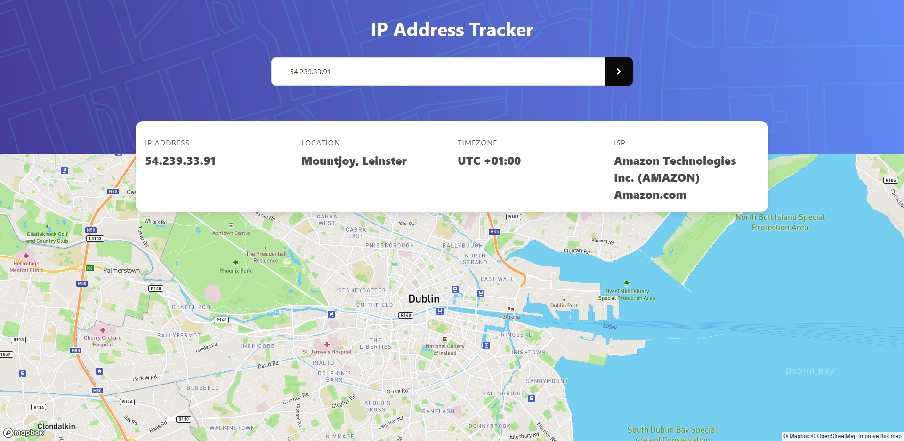
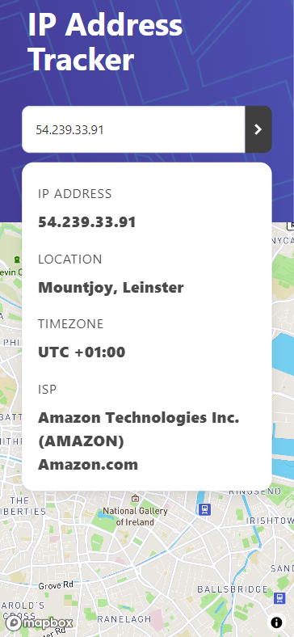

# Frontend Mentor - IP address tracker solution

This is a solution to the [IP address tracker challenge on Frontend Mentor](https://www.frontendmentor.io/challenges/ip-address-tracker-I8-0yYAH0). Frontend Mentor challenges help you improve your coding skills by building realistic projects. 

## Table of contents

- [Overview](#overview)
  - [The challenge](#the-challenge)
  - [Screenshot](#screenshot)
  - [Links](#links)
- [My process](#my-process)
  - [Built with](#built-with)
  - [Continued development](#continued-development)
- [Author](#author)

## Overview

### The challenge

Users should be able to:

- View the optimal layout for each page depending on their device's screen size
- See hover states for all interactive elements on the page
- See their own IP address on the map on the initial page load
- Search for any IP addresses or domains and see the key information and location

### Screenshot

### Links

- Solution URL: [solution webpage](https://www.frontendmentor.io/solutions/responsive-api-address-tracker-V6iM4BI__)
- Live Site URL: [github live website](https://rhesusp.github.io/portfolio/IP_address_tracker/index.html)

## My process

### Built with

- HTML5
- CSS3
- Flexbox
- Responsive thinking
- [Bulma](https://bulma.io/) - CSS framework
- [Mapbox](https://www.mapbox.com/) - Map API
- [Ipify](https://geo.ipify.org/) - IP Geolocation API

### Continued development 	

:hourglass_flowing_sand: Potential future improvements : 
* smooth scrooling map instead of refresh.

## Author

- Website - [camillebernot.xyz](https://camillebernot.xyz)
- Frontend Mentor - [@RhesusP](https://www.frontendmentor.io/profile/RhesusP)